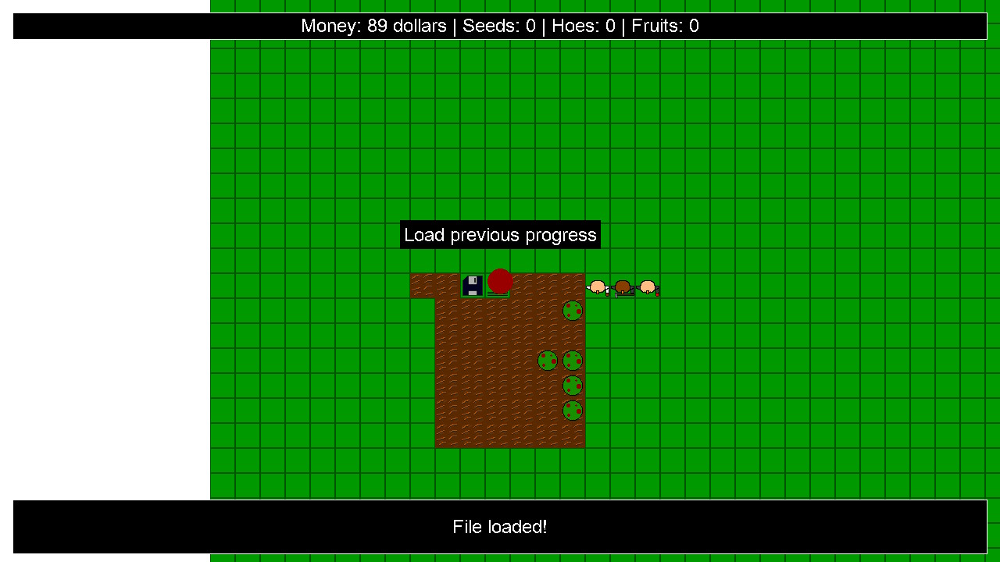

# Mapster

Mapster is a game/homebrew originally created by a 15-year-old for Arduino, now adapted for the Nintendo Switch, PC, and more using the C language upon turning 16.
In this game, you're a farmer where you plant trees and harvest fruits to sell them and pay your taxes!
`mapster.ino` is the original game for the Arduino, this is what I'm trying to make!

## Installation

### Pre-built Release

Download the `mapster.nro` file from the releases section and copy it to `/switch/` on your modded Switch memory card.

### Compile It Yourself

1. Install [DevkitPro](https://devkitpro.org/). Make sure to select the Switch option during installation.
2. Open MSYS2.
3. Navigate to the directory where you extracted the source code, where you can find the Makefile.
4. Run the following command: make

## Controls

- **Up/Down/Left/Right:** Move player character
- **A:** Interact with a map element
- **Plus (+):** Quit the game
- **Save/Load Tile:** Interact with this tile to save or load your progress to/from `sdmc:/switch/mapster.bin`

## Planned Features

- Add taxes and watering, like the original game.
- Better sprites
- Analog control
- Co-op multiplayer
- Optimize the code for improved performance
- Fully port the game to PC, 3DS, Wii U, PSP and many other platforms devkitpro supports.

## Facts About the Gameplay
- Trees will continue to grow even when the game is suspended. They will also grow after you close the game and reload your save.

## Contribution

Contributions are greatly appreciated! Feel free to fork this repository and submit pull requests with your enhancements or bug fixes.

## Credits

- **Code:** AzizBgBoss
- **Sprites:** AzizBgBoss
- **Music:** Taken from `switch-examples/graphics/sdl2-demo`